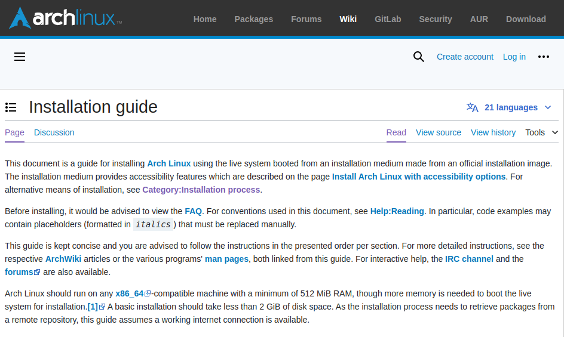
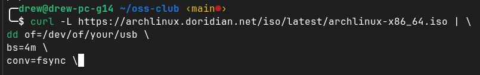
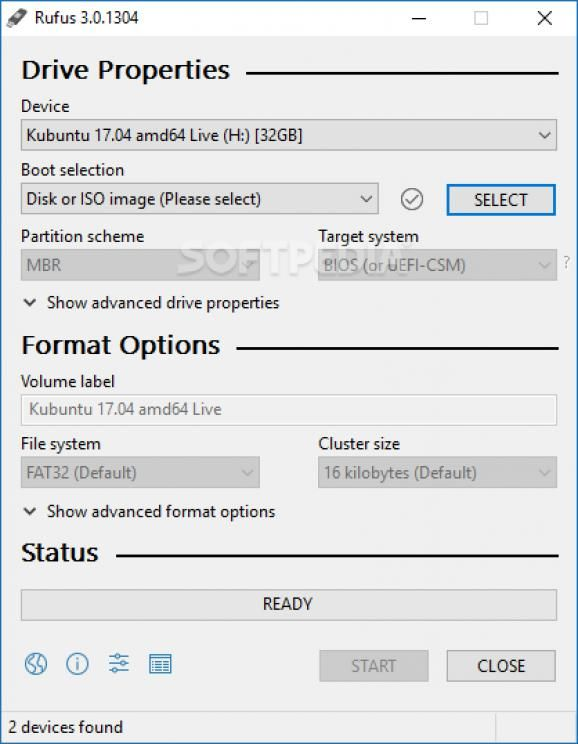

# Installing ArchLinux

## Preconceptions
- arch is hard
    - no, arch requires reading
- arch will always break
    - no, arch is as stable as you make it
- I reinstalled arch 3 times in the last month
    - you're the sysadmin of your system. you'll get better.

## Steps to do anything in arch:
- what do you want to do?
    - how would a nerd do it?
- read the wiki
- READ THE WIKI
- devise a plan for what you want to do based on its contents
- DON'T BLINDLY PASTE WIKI COMMANDS

## How to use the Wiki
- the wiki is a tree
- if you don't traverse the tree, you won't find what you want

## Preparation
- examining hardware
- choosing a disk layout
    - ext/xfs
    - "bUt wHaT aBoUt ZFS!?!
    - what about zfs' baby brother
- choosing a boot toolchain

## Choosing an environment
::: columns

:::: column
- FULL DE's
    - gnome
    - kde
    - cinnamon
::::

:::: column
- BYO DE's
    - xfce
    - lxqt
- TWM's
    - i3
    - sway
    - hyprland
::::
:::

## Preparation cont.
- Security considerations
    - secure boot
    - encryption
    - boot toolchain considerations

# Installation
## Obtain/create installation media

::: columns

:::: column
- on macOS and linux: use `curl` and `dd`

::::
:::: column
- on windows: use rufus

::::

:::

## boot
- plug in your usb and power on
- usually pressing `f2`, `f11`, `f12`, of `del` will get you into the boot picker or the bios. From there, choose your usb

## Networking
- if using wifi, use `iwctl` to connect
- `ping 1.1.1.1` for ip
- `ping google.com` for dns

## time, date, locale, keeb, etc
- defaults to american qwerty, utc time, american english

## setup disks
- DON'T LISTEN TO THE PARTITIONING SCHEME
- refer to the wiki article for your chosen disk layout

## mount your disks
- start with `$ mount /path/to/root/fs /mnt`
- continue filling out the tree
- don't forget to mount your EFI partition at `/mnt/efi`

## package installation
- choose kernel: `linux`,`linux-lts`,`zen`, etc.
- are headers/dkms required
- out of tree packages e.g.`zfs`
- editor e.g. `vim`,`nano`,`nvim`,`micro`,`eMaCs`
- DON'T FORGET NETWORKING e.g. `networknanager`
- genfstab

## Boot toolchain
- differs per method.
- very important

# Post-Installation
## what we have
- kernel
- coreutils
- init system
- userspace
- that's it

## what we don't
- sudo
- users
- most applications
- Desktop Environment
- AUR

# what now?

## make users

::: columns

:::: column
- add a user
- install sudo
- add user to sudoers somehow
- other required groups
::::

:::: column
`# useradd -m -G wheel myuser`

`# pacman -S sudo`

`# visudo`

`# usermod -G other groups myuser`
::::

:::

## install a DE
- graphics drivers
- base DE package
- audio
- gui apps

## Security
- Secure boot

## Ricing
- the term
- Hyprland
- themes
 
